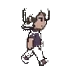

# 🐾 Claw-GA 桌面宠物

基于 PyQt6 的 AI 桌面宠物，带有像素精灵动画和 GenericAgent 智能对话功能。

## 功能特性

- 🎨 **透明像素宠物** - 支持透明背景的像素精灵动画
- 💬 **AI 对话** - 集成 GenericAgent，支持智能对话
- 🎮 **多状态动画** - idle、walk、run、slide、work_sleep 等动画状态
- 🖱️ **拖拽移动** - 左键点击拖拽移动宠物位置
- 📦 **收缩模式** - 双击宠物隐藏/显示聊天框

## 预览图

### 精灵帧图


### 走路帧图


## 项目结构

```
claw-ga/
├── pet_clean.py          # 主程序
├── GenericAgent/         # AI 对话引擎（需要单独配置）
├── sprites_yoffset3/     # 像素精灵图
├── images/               # 预览图片
└── README.md
```

## 快速开始

### 1. 安装依赖

```bash
pip install PyQt6 requests
```

### 2. 配置 GenericAgent

GenericAgent 需要配置 API Key：

```bash
# 创建配置文件
cp GenericAgent/mykey_template.py GenericAgent/mykey.py

# 编辑 mykey.py，填入你的 API Key
# MINIMAX_API_KEY = "your-key-here"
```

### 3. 运行宠物

```bash
python pet_clean.py
```

## 环境要求

- Python 3.11+
- PyQt6
- requests

## 使用说明

- **移动宠物**：左键点击并拖拽
- **收缩/展开**：双击宠物切换聊天面板显示
- **发送消息**：在底部输入框输入内容，AI 会自动回复

## 自定义精灵图

如需替换宠物外观，替换 `sprites_yoffset3/` 目录下的精灵图即可。

每个动作目录包含 8 帧 PNG 图片，尺寸建议 100x100 像素。
